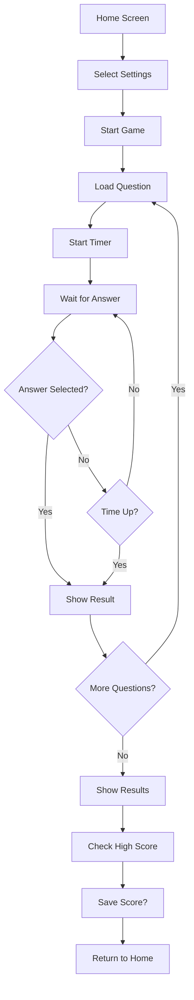

# 🛠️ Development Guide

Welcome to the Trivia Game development guide! This document will help you understand the project structure and how to contribute effectively.

## 📁 Project Structure

```
trivia-game/
├── index.html              # Main HTML file
├── css/
│   └── styles.css          # All styling and responsive design
├── js/
│   ├── app.js              # Main application controller
│   ├── game.js             # Game logic and state management
│   ├── leaderboard.js      # Leaderboard functionality
│   └── questions.js        # Question database
├── assets/
│   └── favicon.ico         # Favicon (to be added)
├── docs/
│   ├── DEVELOPMENT.md      # This file
│   ├── API.md              # API documentation
│   └── ROADMAP.md          # Future features roadmap
├── README.md               # Project overview
├── CONTRIBUTING.md         # Contribution guidelines
└── LICENSE                 # MIT License
```

## 🏗️ Architecture Overview

The application follows a modular architecture with clear separation of concerns:

### Core Components

1. **TriviaApp (app.js)**
   - Main application controller
   - Screen navigation
   - Event handling
   - UI state management

2. **TriviaGame (game.js)**
   - Game logic and flow
   - Score calculation
   - Timer management
   - Question progression

3. **TriviaLeaderboard (leaderboard.js)**
   - Score persistence
   - Leaderboard display
   - Local storage management

4. **TriviaQuestions (questions.js)**
   - Question database
   - Category management
   - Random question selection

## 🎮 Game Flow



## 🧩 Key Features Implementation

### Question System
- Questions are stored in `questions.js` with categories and difficulties
- Each question has: question text, 4 answers, correct answer index, category
- Random selection ensures variety in gameplay

### Scoring System
- Base points vary by difficulty (Easy: 10, Medium: 15, Hard: 20)
- Time bonus: up to 10 points based on remaining time
- Total score = (base points + time bonus) × correct answers

### Timer System
- 30 seconds per question
- Visual progress bar with color changes
- Automatic submission when time expires

### Responsive Design
- Mobile-first approach
- Flexbox and CSS Grid for layouts
- Breakpoints at 768px and 480px
- Touch-friendly buttons

## 🎨 Styling Guidelines

### Color Palette
- Primary: `#667eea` (Blue gradient start)
- Secondary: `#764ba2` (Purple gradient end)
- Success: `#28a745`
- Danger: `#dc3545`
- Warning: `#ffc107`

### Typography
- Font Family: 'Poppins', sans-serif
- Weights: 300 (light), 400 (regular), 600 (semi-bold), 700 (bold)

### Component Classes
- `.btn` - Base button styling
- `.btn-primary` - Primary action buttons
- `.btn-secondary` - Secondary action buttons
- `.screen` - Main content screens
- `.container` - Content wrapper with max-width

## 📱 Responsive Breakpoints

```css
/* Mobile First */
@media (max-width: 768px) {
    /* Tablet and below */
}

@media (max-width: 480px) {
    /* Mobile phones */
}
```

## 🔧 Local Development

### Prerequisites
- Modern web browser
- Text editor/IDE
- Basic knowledge of HTML, CSS, JavaScript

### Setup
1. Clone the repository
2. Open `index.html` in a browser
3. No build process required - it's vanilla JavaScript!

### Testing
- Test across different browsers
- Verify responsive design on various screen sizes
- Check accessibility with screen readers
- Test localStorage functionality

## 🚀 Adding New Features

### Adding Questions
1. Open `js/questions.js`
2. Add questions to the appropriate category and difficulty
3. Follow the existing format:
```javascript
{
    question: "Your question here?",
    answers: ["Option 1", "Option 2", "Option 3", "Option 4"],
    correct: 0 // Index of correct answer (0-3)
}
```

### Adding Categories
1. Add new category to `questionDatabase` in `questions.js`
2. Include easy, medium, and hard difficulties
3. Update category select options in `index.html`

### Adding Screens
1. Create new section with class `screen` in `index.html`
2. Add navigation logic in `app.js`
3. Implement screen-specific functionality

## 🧪 Testing Guidelines

### Manual Testing Checklist
- [ ] All navigation buttons work
- [ ] Game starts with selected settings
- [ ] Timer functions correctly
- [ ] Score calculation is accurate
- [ ] Leaderboard saves and displays correctly
- [ ] Responsive design works on mobile
- [ ] Keyboard shortcuts function
- [ ] Error handling works properly

### Browser Compatibility
- Chrome (latest)
- Firefox (latest)
- Safari (latest)
- Edge (latest)

## 🎯 Performance Considerations

### Optimization Tips
- Images should be optimized and use appropriate formats
- CSS and JS are minified for production
- Local storage is used efficiently
- Event listeners are properly managed

### Memory Management
- Timer intervals are cleared when not needed
- Event listeners are added once during initialization
- Large arrays are avoided in question database

## 🔍 Debugging

### Common Issues
1. **Questions not loading**: Check question database format
2. **Timer not working**: Verify interval clearing
3. **Score not saving**: Check localStorage availability
4. **Responsive issues**: Test CSS media queries

### Debug Tools
```javascript
// Access app state in console
window.TriviaApp.getAppState()

// Check question database
window.TriviaQuestions.database

// View leaderboard data
window.TriviaLeaderboard.getLeaderboard()
```

## 📚 Additional Resources

- [MDN Web Docs](https://developer.mozilla.org/)
- [CSS Grid Guide](https://css-tricks.com/snippets/css/complete-guide-grid/)
- [Flexbox Guide](https://css-tricks.com/snippets/css/a-guide-to-flexbox/)
- [JavaScript Best Practices](https://developer.mozilla.org/en-US/docs/Web/JavaScript/Guide)

## 🤝 Getting Help

If you need help:
1. Check this documentation
2. Look at existing code examples
3. Search for similar issues in the repository
4. Ask questions in discussions
5. Create an issue for bugs

Happy coding! 🎮
